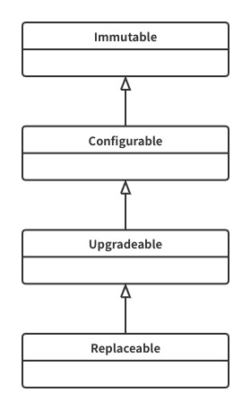

## 智能合约的不可能三角

去中心化绝不是一个简单的问题，所幸的是，Vitalik 曾经多次深入探讨过这个话题，我们不需要从头去研究这个问题，我们姑且认为以太坊是一个比较去中心化的智能合约平台。

但是否可以认为，由于 一个 app 是基于以太坊智能合约实现，因此就继承了其去中心化特性呢？完全不是的！

以太坊平台的分散性决定了一个 app 分散性的上限，而它的下限是由创始团队以及该 app 使用的技术所决定的，其分散性的下限可以低至 0，即一个基于以太坊实现的 app 可能是完全中心化的。

那么，RealDAO 作为由以太坊平台上的一组智能合约实现的稳定币协议，如何评估和衡量其分散性呢？

这篇文档试图从以下几个概念来分析 RealDAO 的分散性：

- Variability: 我们要弄清楚 RealDAO 中哪些是可变的，哪些是不可变的，对于那些可变项，是可配置的、可升级的还是可以被完整替换的
- Decentrality of governance power: 对于那些可变项，谁拥有改变的权力？是某个管理员账户、还是少数人组成的集体、还是民主表决？
- Availabiity: 整个系统有没有因为过于复杂或过于依赖某个单点的模块，如果有可能会导致系统过于脆弱，随时变得不可用

根据以上定义，我们稍加推理就可以发现，这三者不可兼得：

- 如果对可变性要求较高，即一个系统需要经常修改配置和升级，为了保证高可用，就必然需要一个执行效率高的治理机构，也就不可能采取全民表决的治理方式
- 如果同时要求权力高度分散且系统高度可用，那么就只能降低系统的复杂度并尽量降低其可变性
- 如果一个高度可变的系统搭配了一个权力高度分散的治理机制，那么系统可能会出现由于修复不及时导致的瘫痪或重大损失，即可用性不高

如果一个系统的可用性不高，比如必须依赖某种高配置的机器或某个中心化的机构，或者由于出现问题且得不到修复导致的不可用，那么谈其分散性是没有意义的，也就是说高可用性是我们必须要选择的。

另外，从前面的系统架构图可知，RealDAO 协议由几十个合约组成，复杂度远超一般的应用，因此我们必须保证它的高度可变性，以应对随时可能出现的漏洞。
为了保证快速修复系统，我们必须舍弃一部分权力的分散性。

但这并不意味着 RealDAO 必须选择一个高度中心化的治理机制。

## RealDAO 的去中心化治理机制

我们根据开发经验和常识可以总结出两条规律：

1. 一个软件系统总是在前期 bug 较多，它运行越久，出现 bug 的可能性越低
2. 简单的变更需要并且可以频繁执行，重大变更要谨慎执行

另外，对于修复漏洞的方法，我们也可以总结出两种常见的方法：

1. 防御型，即服务暂停或服务降级，这种方法可以快速阻止错误蔓延，使得损失最小化且不会带来额外风险(比如新的漏洞)，但缺点是不能修复错误
2. 进攻型，即升级代码，这种方法可以真正地修复错误，但这种升级的权力要被严格限制，以防止其被滥用

基于以上逻辑，我们进行了如下设计：

- 权力机构由三部分组成，Guardian、Council、Democracy，他们之间既相互制约、又相互协作
- Guardian 是一个由开发负责人掌握的管理员账户，在系统前期用于快速修复漏洞和代码升级
- Council 是由少数成员组成的联合表决机构，它拥有大部分的治理接口调用权限，用于执行那些需要频繁进行的日常操作
- Democracy 是一个民主表决机构，它是 RealDAO 系统的最高权力机构，它可以执行任何级别的系统变更，包括使用新的合约替换它自身，由于成本较高，它主要被用于产生和执行重大决策
- 随着系统的逐步稳定以及 Council 机构的稳定运转，Guardian 的权力可以被强制取消，之后就形成了一个类似代议制的双层权力治理体系
- 另外，系统还提供了不同级别的变更接口，包括修改协议参数、服务降级、系统暂停、合约升级、合约替换、合约终止变更等治理操作

## RealDAO 的可用性分析

RealDAO 系统由客户端、链上服务端、链下服务端组成。

其中，客户端代码主要依赖项是 web3、react 和 RealDAO ABIS 以及一些库函数，它们都是很容易获取的，不存在可用性问题。

链上服务端即链上智能合约，其可用性取决于以太坊平台的可用性，只要能找到以太坊节点，就可以访问 RealDAO 链上服务。

链下服务端目前仅包含一个简单的索引服务，用于帮助清算者获得处于清算条件边缘的账户信息，这个服务的可用与否不影响 RealDAO 系统提供的其他服务，比如存款、借贷、提取、偿还、挖矿等，而且这个服务比较简单，任何开发者都可以在几分钟内在自己的服务器上搭建起来，因此可以说它也是高可用的。

<!-- prettier-ignore -->
!!! note
	这里的高可用与互联网公司经常提的服务高可用并不是完全符合，这里所指的更多是一种可得性。RealDAO 的客户端使用的以太坊节点的是`infura`所提供的，因此其可用性取决于`infura`的可用性，如果`infura`内部没有做冗余和灾备，很有可能会因为意外事件，导致 RealDAO 服务在一段时间内是不可用的，但 RealDAO 服务永远是可得的，因为任何一个开发者马上可以找到一个新的`provider`替换掉`infura provider`。RealDAO 的链下服务端同理，也是永远可得的，但未必 24 小时不间断地可用，RealDAO 的开发者们也不会专门为其提供真正的高可用服务，因为那样 RealDAO 开发者就成了可能的单点故障。

## RealDAO 的可变性分析

我们把一个合约的可变性按程度分成以下几个等级：

- 不可变 Immutable: 只有合约中的状态是可变的，但状态的变更完全依赖于事先写好的算法，不依赖于外部的临时决定(比如治理接口)
- 可配置 Configurable: 合约算法不可变，但部分算法的参数可以通过治理接口修改，或者实体数据可以通过治理接口修改，比如 Distributor 中的 closePool
- 可升级 Upgradeable: 升级合约算法，但保留合约中的现存所有状态
- 可替换 Replaceable: 整个合约完全被替换，包括状态和算法，只有部分抽象接口保持不变

这些级别的继承关系如图所示：

可变性级别的继承含义是，子类可能拥有父类的特性，但父类绝不会拥有子类的特性。比如，一个 Upgradeable 合约也可以是 Configurable 的，但一个 Configurable 合约不可能被升级。

RealDAO 系统中关键合约的可变性如下表所示：

| 合约                 | 可变性       | 变更特权  | 备注                                                              |
| -------------------- | ------------ | --------- | ----------------------------------------------------------------- |
| DOL                  | Immutable    | -         | DOL 的供应量由 HDOL 合约间接管理，但 DOL 本身 Immutable           |
| RDS                  | Configurable | Deployer  | 设置了上级控制合约(即 Distributor)地址之后，RDS 就成为 Immutable  |
| Distributor          | Upgradeable  | Council   | 系统初期属于 Upgradeable，之后可以通过治理接口降级为 Configurable |
| ChainlinkPriceOracle | Replaceable  | Council   |                                                                   |
| InterestRateModel    | Replaceable  | Council   |                                                                   |
| MarketController     | Upgradeable  | Council   |                                                                   |
| RToken               | Replaceable  | Council   |                                                                   |
| ProtocolReporter     | Replaceable  | Council   |                                                                   |
| Council              | Replaceable  | Democracy |                                                                   |
| Democracy            | Replaceable  | Democracy |                                                                   |
| Orchestrator         | Upgradeable  | Democracy |                                                                   |
| Supreme              | Configurable | Democracy |                                                                   |

<!-- prettier-ignore -->
!!! note
	变更特权省略了 Guardian，Guardian 在初期的权力与 Democracy 相同，Democracy 拥有 Council 所有的权力

## 总结

虽然不是每个智能合约都需要高度去中心化，还有很多其他特性也是我们选择区块链的原因，比如不易篡改性、透明性等，但去中心化仍然是一个不可替代的特性，特别是在稳定币这个领域。
在 defi 的世界中，稳定币协议是最底层的基石，其影响力举足轻重，我们认为有必要为它设计一个真正的去中心化机制，只有真正去中心化了，我们才能说，我们创造了一个真正的无偏见的、全世界可用的稳定数字货币。

同时，解决去中心化问题不能光靠口号，本文提供了一个科学的评估和衡量一个系统的去中心化的方法，通过这个方法，可以让 dApp 的用户们和投资者们清楚地知道，当专家们在谈去中心化时，到底在谈些什么，也可以让用户和投资者们清楚地知道，一个系统到底是不是去中心化，到底有多么去中心化。

当然由于篇幅所限，这篇文档并没有彻底讨论关于去中心化的所有问题，比如工具链中每一个环节的维护者问题，如果工具链中的任何一个环节只是在理论上是去中心化的和无单点故障的，但是在实际运营中，找不到多个能力足够且有意愿为其贡献的开发者，只能依赖于某个特定的开发者，那这个系统仍然有单点故障，它的实际分散性也是不高的。但本文的方法可以用于评估一个复杂智能合约系统在理论上的去中心化的可能性及程度。
