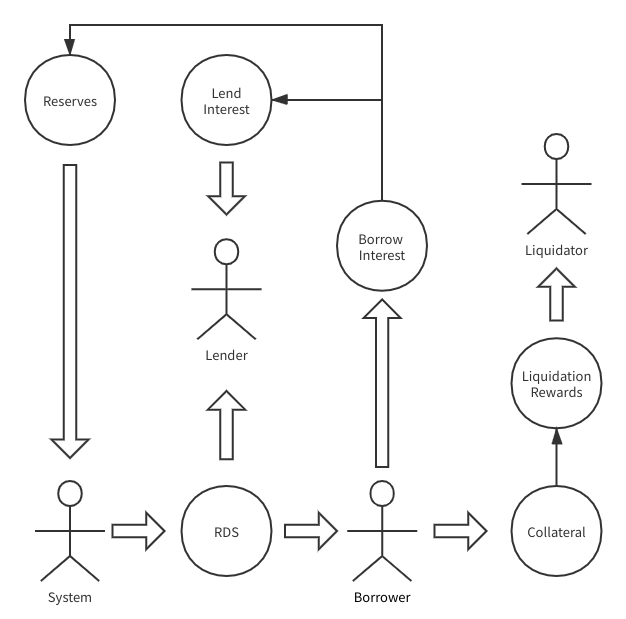
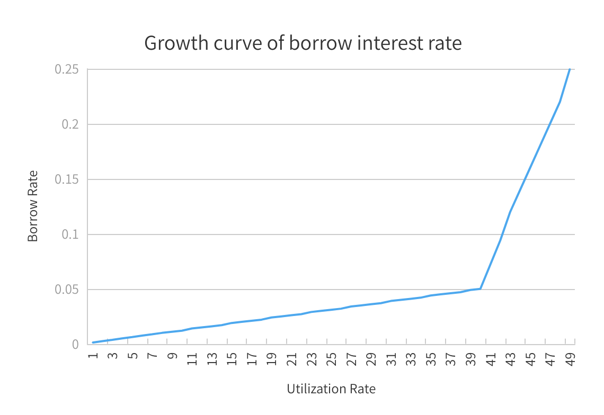

在 RealDAO 协议中，一共有四中角色：

- Lender: 为协议供应资产的用户，供应资产后 Lender 可以铸造 DOL，或者借给他人以分享利息
- Borrower: 借出资产的用户，借出时系统开始计算利息，用户还款时需要本息一同偿还，一部分利息会流入系统准备金池
- Liquidator: 当 Borrower 的抵押资产价值低于一定阈值，不足以担保所债务时，Liquidator 可以帮助其偿还债务并获得折价计算的抵押资产，任何人都可以成为 Liquidator
- System: 系统为 Lender 和 Borrower 提供 RDS Token 作为激励，并获得 Borrower 的部分借款利息

<!-- prettier-ignore -->
!!! note
	由于用户在借款时必须拥有担保资产，因此借贷市场的用户一般同时拥有 Lender 和 Borrower 的身份，是一种资产或市场的 Lender，另一种资产或市场的 Borrower。

## Interest Rate

Borrower 支付的利息取决于利率，利率的大小取决于供需关系，供需关系通过资产使用率进行量化，当使用率变大时，说明需求增加或供给减少，这时利率就变高，当使用率变小时，说明供给增加或需求减少，这时利率就变低。

资产使用率和借款利率的计算公式如下：

```
utilizationRate = totalBorrows / (totalCash + totalBorrows - reserves)

if (utilizationRate <= kink) {
  borrowRate = baseRate + utilizationRate * m
} else {
  borrowRate = baseRate + kink * m + (utilizationRate - kink) * j
}
```

在当前的 RealDAO 系统中，相关系数的默认值为：

```
baseRate = 0.01
m = 0.05
j = 1.09
kink = 0.8
```

这些值都可以通过治理接口进行调整。



上图中可以直观地看出借款利率与资产使用率的增长关系。

<!-- prettier-ignore -->
!!! note
	注意横坐标需乘以 2，在图中转折点处的横坐标表示使用率达到了 80%。

还有一点需要注意的是，DOL 市场的利率除了受用户的供需关系影响外，还受系统的调控，系统可以通过治理接口增加和降低 DOL 的供应量。这个特性是必须的，因为 DOL 是系统内生的资产，治理机构必须根据市场的反应适度调整它的供应量，使得利率得以保持在一个适当的范围内浮动。

## Liquidity Mining

用户供应资产和借出资产都会增加算力值，但不同的资产市场对应不同的算力池。

系统为每一个 `RToken` 创建相应的算力池，比如 `ETH Pool`，`DOL Pool`，这种 Pool 我们称之为 `Lending Pool`。

除了` Lending Pool` 还有一种 Pool 叫做 `Exchanging Pool`，是由治理机构动态创建。这种算力池能够接收用户在 `dex` 中通过提供流动性获得的流动性凭证，用户通过在`Exchanging Pool`抵押流动性凭证以获取算力。每一种流动性凭证对应一个 `Exchanging Pool`。

RDS 发行上限为 100M，除团队预留 20M 外，80M 用于永久流动性挖矿。RDS 发行规则为每一年发行剩余总量的一半，即类似比特币的每年减半模型。
假设区块生产间隔为 3 秒，第一年每个区块发行 RDS 数量为`3.805175`。
每个区块发行的 RDS 平均分配当前被激活的所有算力池，假如有 4 个算力池，则每个算力池每个区块总共可以分 `0.95129375` 个 RDS，然后再按照算力池内部用户的算力占比来计算用户的分配数量。

整个分配过程完全在链上实时进行，用户只要产生算力，就可以源源不断地获得 RDS 了。

### 估算 APY

```
一年RDS产量 = 40000000
出块速度 = 3s
一年区块产量= 10512000
每个区块RDS总产量 = 40000000 / 10512000 = 3.805175
HUSD/RDS矿池RDS产量 = 3.8051750 / 4 = 0.95129375

假设 HUSD/RDS总锁仓金额为10,000,000$，RDS价格为1$，那么
APY(HUSD/RDS) = 40000000 / 4 * 1$ / 10000000 = 100%
```

<!-- prettier-ignore -->
!!! note
	用户必须发起一个`claim`交易才能真正将分配的 RDS 领取到账户中，在这之前用户的权益将被记录在 Distributor 合约的账本中。

## Liquidator Incentive

RealDAO 协议对于每种资产都分别设置不同的担保率，主流资产的担保率一般为`75%`。
即用户抵押价值 100$的资产时，可以最多借出价值75$的其他资产。RealDAO 协议通过超额抵押来保证 DOL 的价格恒定以及不同资产类型所有者的资产安全性。

当 Borrower 的抵押资产不断贬值的时候，可能面清临被算的风险。RealDAO 通过计算账户的`liquidity`来判断该账户是否可以被清算。

```
liquidity = sum(collaterals) - sum(borrows)
```

当`liquidity`为负数时，任务账户都可以对该账户发起清算操作，清算过程包括偿还债务和获得抵押资产两个步骤，系统为了激励清算行为，会为清算者分配额外的奖励，这个奖励取决于偿还债务数量和激励因子，公式如下：

```
collateralsValueSeized = debtsValueRepaied * (1 + liquidationIncentiveFactor)
```

<!-- prettier-ignore -->
!!! note
	在 RealDAO 系统中，`liquidationIncentiveFactor`默认为`0.08`，即清算者可以获得额外`8%`的奖励。
	该参数可以通过治理接口进行修改。

## Surplus

## Buyback
