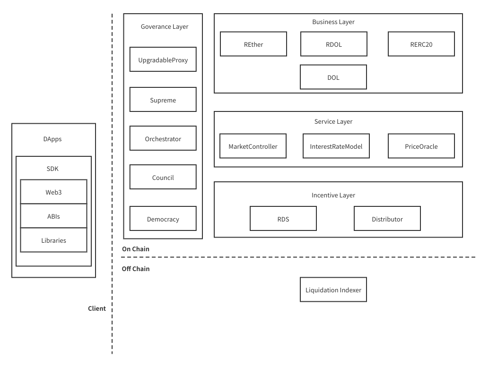
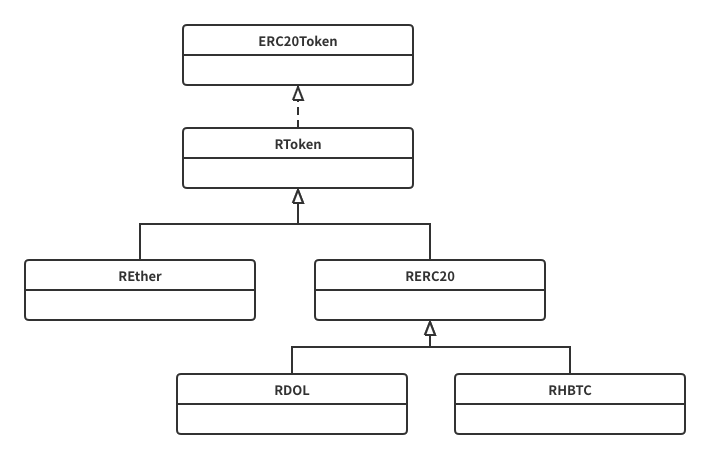
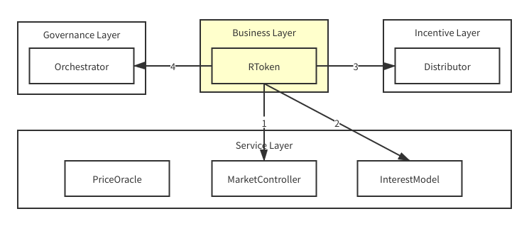
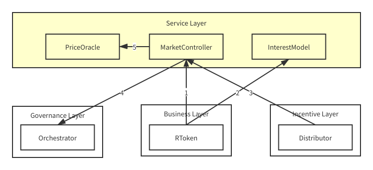
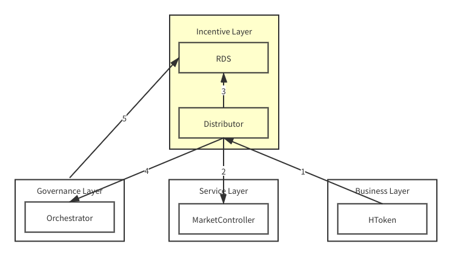
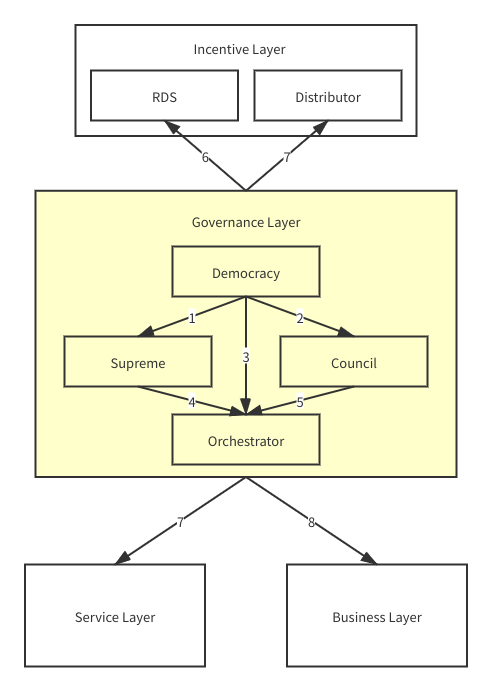

# Techinal Architecture

## 链上服务端

### 业务层

业务层实现了稳定币铸造和抵押资产借贷市场的核心逻辑，与客户端交互的主要模块都在一层。
具体地说，业务层将该核心业务分解为若干个交易接口：

- mint: 供应并抵押资产
- redeem: 赎回抵押资产
- borrow: 铸造稳定币或借出其他类型的抵押资产
- repay: 偿还债务
- liquidate: 清偿债务并获得抵押资产
- transfer: 转移资产抵押凭证

与 Compound 的 CToken 概念类似，RealDAO 对不同特征资产的借贷合约进行了抽象，即 RToken，RToken 的继承关系如下：

除用户交易接口外，RToken 也提供少量的治理接口：

- addReserves: 增加备用金
- reduceReserves: 提取备用金
- setReserveFactor: 设置备用率

HDOL 还包含两个额外接口，用于调整系统的稳定币供应量：

- increaseSystemSupply
- reduceSystemSupply

业务层组件间关系如图所示

1. RToken 调用服务层 MarketController 来检查业务控制策略，以及查询部分协议参数
2. RToken 调用服务层 InterestRateMode 来查询资金使用率和借款利率
3. RToken 调用激励层 Distributor 来更新用户交易时产生的算力(贡献值)
4. RToken 调用治理层 Orchestrator 进行鉴权

### 服务层

服务层包含三个模块：

- MarketController: 管理业务控制策略
- InterestRateModel: 提供利率算法并管理相关参数
- PriceOracle: 抽象的价格预言机服务，用于查询数字资产对应美金的价格，目前唯一实现为`ChainlinkPriceOracle`

服务层除了为业务层提供以上三个服务外，还包含大量的治理接口，比如 MarketController 中的

- supportMarket
- closeMarket
- liquidateMarket
- removeMarket
- toogleSuspension
- setLiquidationIncentive
- setCloseFactor
- setCollateralFactor

InterestRateModel 中的：

- updateModel

PriceOracle 中的：

- setPriceFeedAddress

服务层组件内即组件间关系为：

1. 业务层 RToken 调用 MarketController 检查业务控制策略及部分协议参数
2. 业务层 RToken 调用 InterestRateModel 查询资金使用率和借款利率
3. 激励层 Distributor 调用 MarketController 检查业务控制策略
4. MarketController 调用治理层 Orchestrator 进行鉴权
5. MarketController 调用 PriceOracle 查询加密资产价格

### 激励层

激励层的核心逻辑在 Distributor 模块内，它可以动态地分配算力池，算力池用于计算贡献者的应得报酬。
该模块设计了两种类型的算力池：

- Lending Pool: 用户在借贷市场完成交易时，RToken 合约将自动更新用户的算力到相应的算力值，每种 RToken 对应一个算力池
- Exchanging Pool: 用户可以将指定的 DEX liquidity token 存入该算力池以获取算力，这种算力池由治理机构动态创建

激励层组件内及组件间关系为：

1.  业务层 RToken 调用 Distributor 来更新用户交易时产生的算力(贡献值)
2.  Distributor 调用服务层 MarketController 检查业务控制策略
3.  当用户索取奖励时，Distributor 调用 RDS 的 mint 接口来增发激励 Token
4.  Distributor 调用治理层 Orchestrator 进行鉴权
5.  治理层 Democracy 模块 在民主表决时通过 RDS 来完成 stake proof

### 治理层

RealDAO 协议综合考虑了去中心化、安全性、可升级性、效率等因素，设计了一个较为完备的代议制治理架构，主要包含以下四个模块：

- Council: 由少数管理员组成的弱中心化签名机构，用于执行频率较高的日常管理操作
- Democracy: 民主表决机构，是 RealDAO 协议中最高权力机构，用于产生和执行重大管理决策
- Orchestrator: 合约管理中心，是 RealDAO 协议的治理中枢，用于升级除自身外的所有层的智能合约的实现，包括 Council、Democracy 在内的治理合约
- Supreme: 用于升级 Orchestrator

为了防止治理合约出现意外漏洞，RealDAO 还在 Orchestrator 中设置了一个守护者账户，用于系统初期治理机构不能正常运作时，执行必要的操作。
当系统稳定运转一定时间后，该守护者账户可自行退位或被其他治理机构强行退位，以保证系统的去中心化。

治理层组件内及组件间关系为：

1. Democracy 调用 Supreme 来升级 Orchestrator
2. Democracy 调用 Council 中的治理接口，如启动新任期、设置理事会参数等
3. Democracy 调用 Orchestrator 的治理接口，比如更换 Council 合约地址等
4. Supreme 通过 UpgradeableProxy 来升级 Orchestrator 的实现
5. Council 调用 Orchestrator 的治理接口，如升级普通智能合约实现或更换普通智能合约地址等
6. Democracy 在民主表决时通过激励层 RDS 来完成 stake proof
7. 调用激励层 Distributor 的治理接口，如创建算力池、关闭算力池等
8. 调用服务层的治理接口
9. 调用业务层的治理接口

## 链下服务端

RealDAO 协议的链下服务端目前只包含一个简单的清算索引服务，用于为清算者提供方便的抵押债仓信息查询服务。
该服务使用`nedb`作为数据库，通过`web3`订阅 RealDAO 合约事件并同步每一个账户的抵押债仓信息。
任何人都可以快速地部署该服务，因此它不会影响 Hade 协议的去中心化程度。

## 客户端

RealDAO 开发团队提供了一个基于`react`的单页应用，该应用暂时可以满足普通借贷用户、清算用户以及治理机构管理员的一般需求。
未来如果有需要，社区成员或生态合作伙伴可以利用`RealDAO SDK`或 RealDAO 合约接口创造更多的功能丰富的 dApps。
